# Sistem Informasi Akademik (SIAKAD)

## Tugas Besar Web II 

# link website 
 
 http://nadia.ifalgorithm24.web.id/

### Deskripsi Aplikasi

Sistem Informasi Akademik (SIAKAD) merupakan aplikasi berbasis Laravel yang digunakan untuk mengelola data akademik kampus. Aplikasi ini memiliki dua role pengguna yaitu Admin dan Mahasiswa.

Admin memiliki hak akses untuk mengelola seluruh data akademik seperti data dosen, mahasiswa, mata kuliah, jadwal perkuliahan, dan Kartu Rencana Studi (KRS). Sedangkan Mahasiswa memiliki hak akses untuk melihat mata kuliah, melihat jadwal perkuliahan, melihat KRS, dan melakukan logout dari sistem.

---

# Teknologi yang Digunakan

* Laravel 12
* PHP 8.2
* MySQL
* Bootstrap 5
* Laravel Breeze
* Spatie Permission

---

# Fitur Utama

## Admin

* Login dan Logout
* Dashboard Admin
* CRUD Data Dosen
* CRUD Data Mahasiswa
* CRUD Data Mata Kuliah
* CRUD Data Jadwal Perkuliahan
* CRUD Data KRS

## Mahasiswa

* Login dan Logout
* Melihat Data Mata Kuliah
* Melihat Jadwal Perkuliahan
* Melihat Data KRS

---

# Dokumentasi Halaman

## 1. Halaman Login

Halaman login digunakan untuk melakukan autentikasi pengguna sebelum masuk ke dalam sistem.

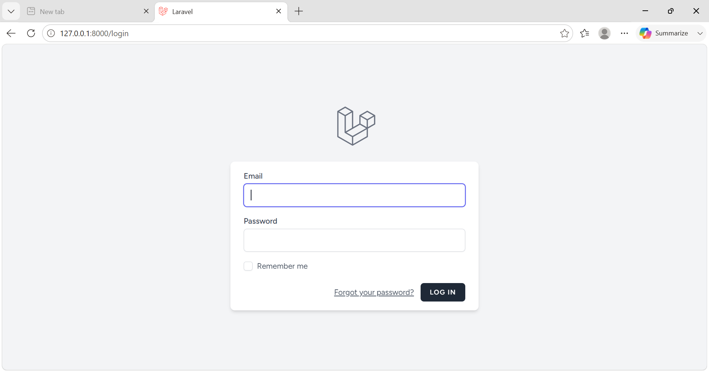

---

## 2. Dashboard Admin

Halaman utama administrator yang menampilkan informasi sistem dan statistik data akademik.

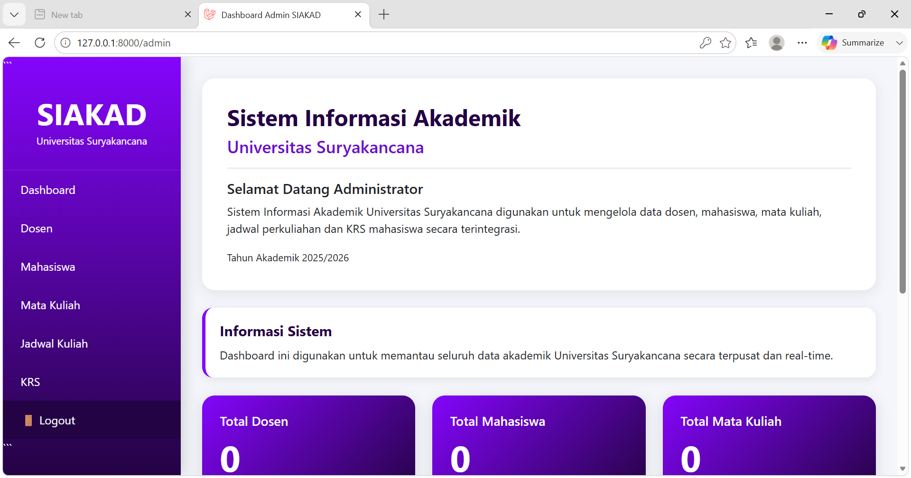

---

## 3. Data Dosen

Halaman untuk mengelola data dosen.

Fitur:

* Tambah Dosen
* Edit Dosen
* Hapus Dosen
* Lihat Data Dosen

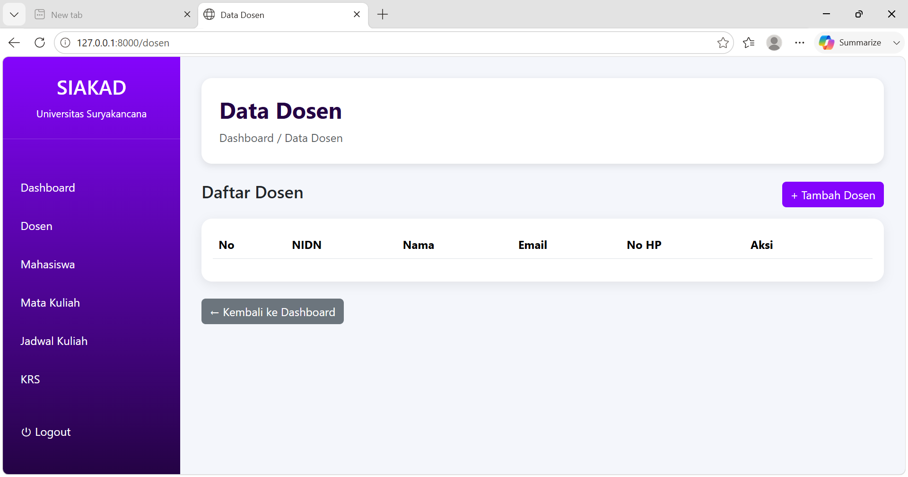

---

## 4. Form Tambah Dosen

Halaman yang digunakan untuk menambahkan data dosen baru ke dalam sistem.

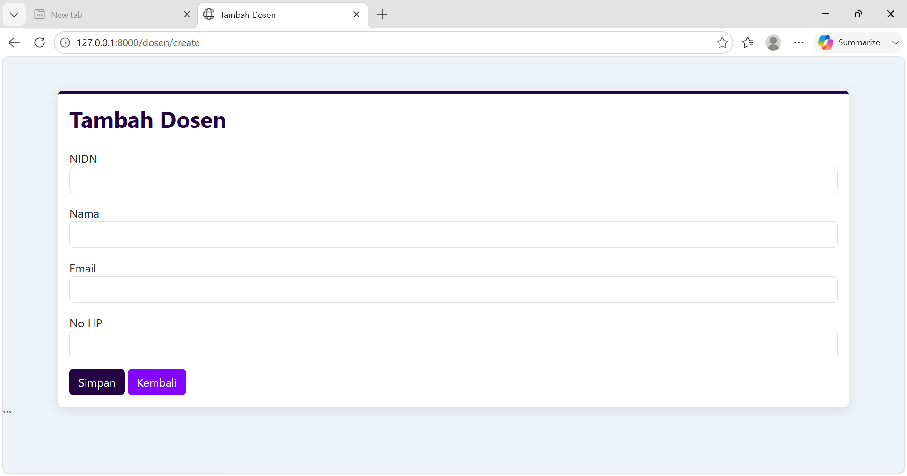

---

## 5. Data Mahasiswa

Halaman untuk mengelola data mahasiswa.

Fitur:

* Tambah Mahasiswa
* Edit Mahasiswa
* Hapus Mahasiswa
* Lihat Data Mahasiswa

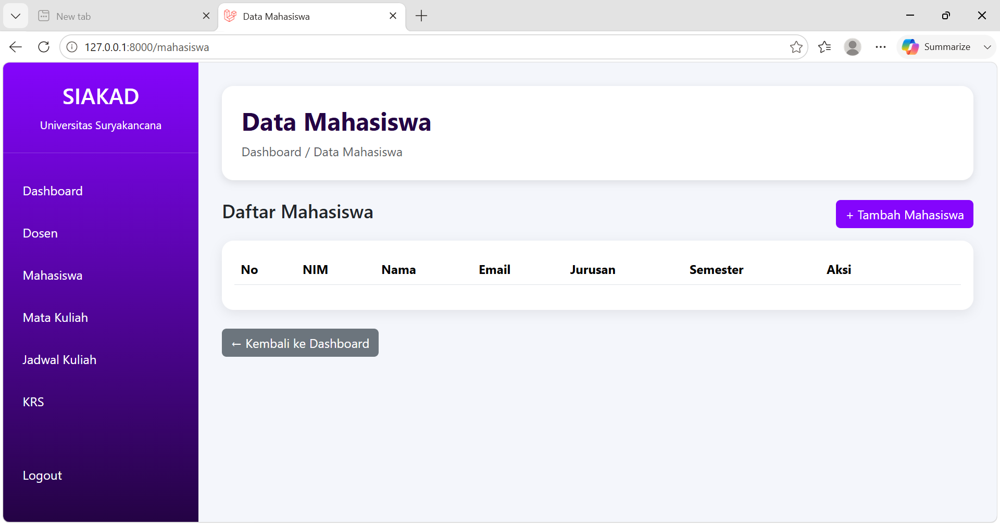

---

## 6. Form Tambah Mahasiswa

Halaman yang digunakan untuk menambahkan data mahasiswa baru.

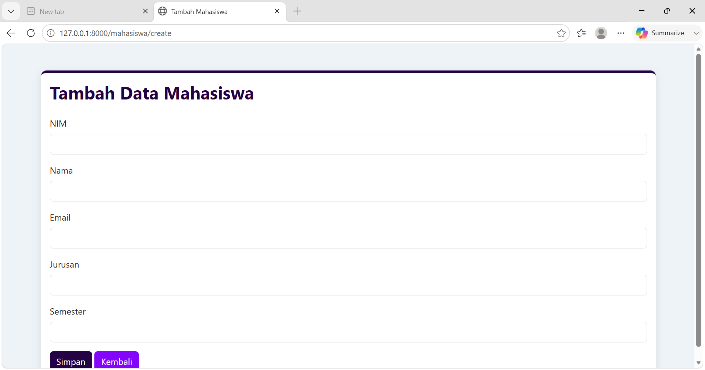

---

## 7. Data Mata Kuliah

Halaman untuk mengelola data mata kuliah yang tersedia.

Fitur:

* Tambah Mata Kuliah
* Edit Mata Kuliah
* Hapus Mata Kuliah
* Lihat Data Mata Kuliah

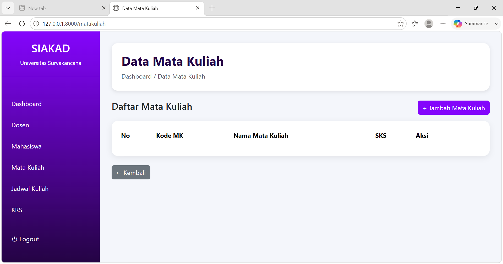

---

## 8. Form Tambah Mata Kuliah

Halaman yang digunakan untuk menambahkan data mata kuliah baru.

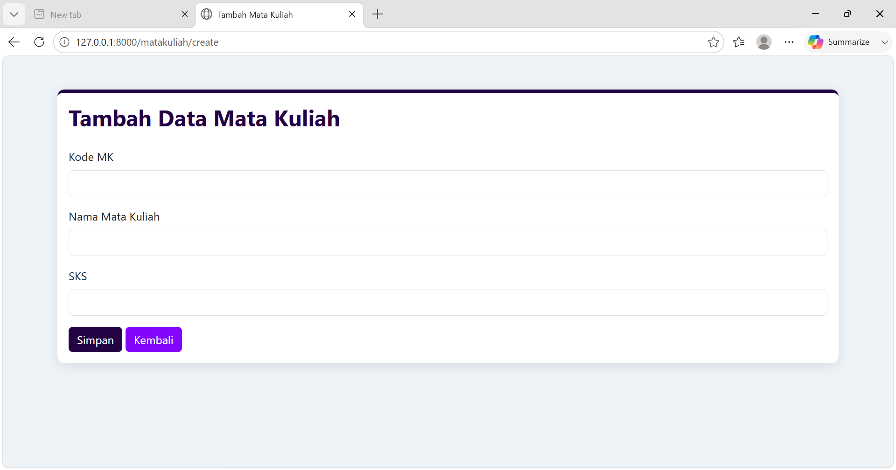

---

## 9. Data Jadwal Perkuliahan

Halaman untuk mengelola jadwal perkuliahan.

Fitur:

* Tambah Jadwal
* Edit Jadwal
* Hapus Jadwal
* Menentukan Dosen Pengajar
* Menentukan Mata Kuliah
* Menentukan Hari dan Jam Perkuliahan

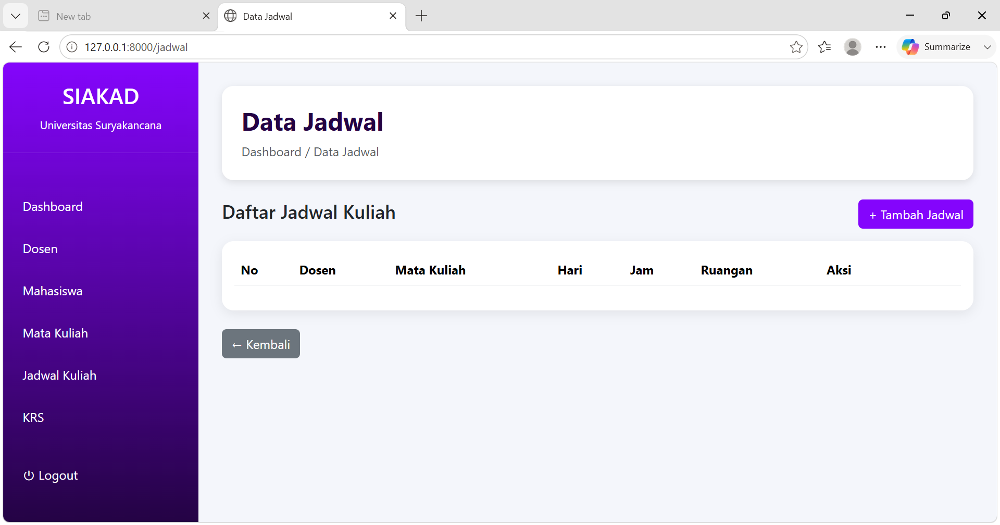

---

## 10. Form Tambah Jadwal

Halaman yang digunakan untuk menambahkan jadwal perkuliahan baru.

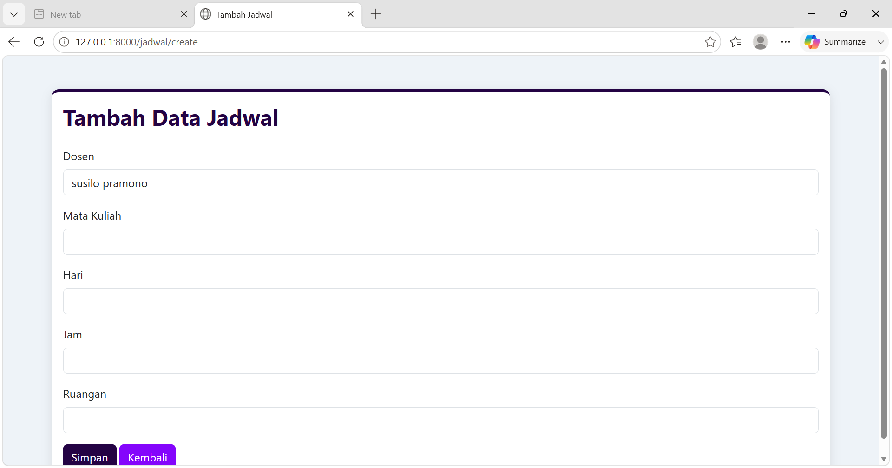

---

## 11. Data KRS

Halaman untuk mengelola Kartu Rencana Studi (KRS).

Fitur:

* Tambah KRS
* Edit KRS
* Hapus KRS
* Lihat Data KRS

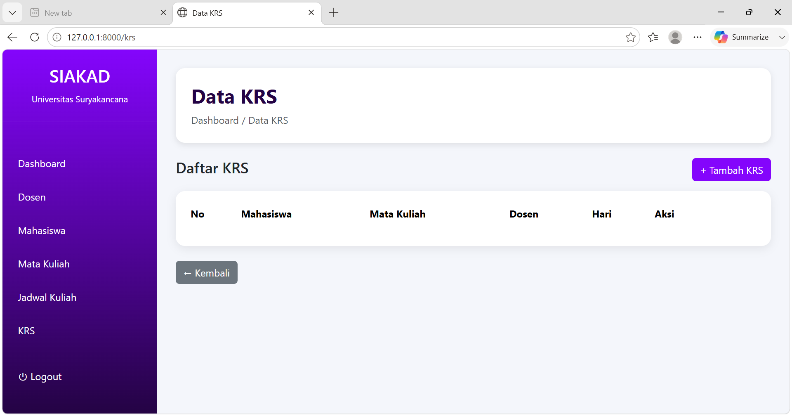

---

## 12. Form Tambah KRS

Halaman yang digunakan untuk menambahkan data KRS mahasiswa.

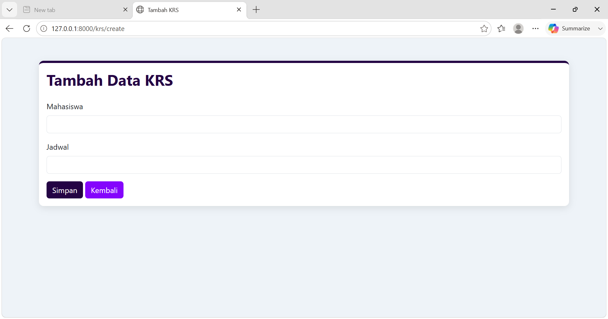

---

## 13. Dashboard Mahasiswa

Halaman utama yang ditampilkan setelah mahasiswa berhasil login.

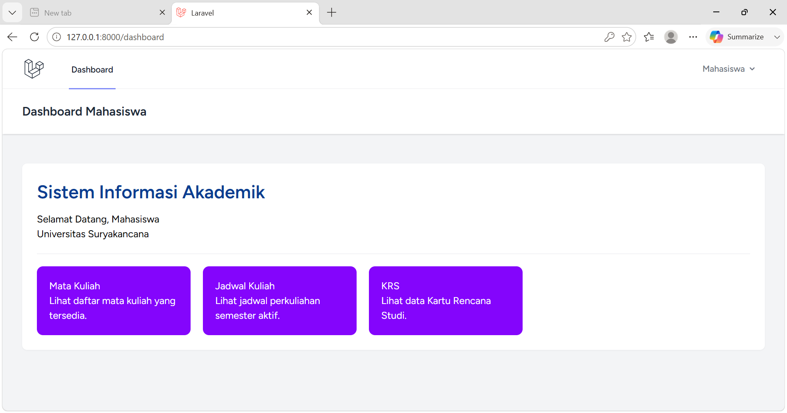

---

## 14. Halaman Lihat Mata Kuliah

Halaman yang digunakan mahasiswa untuk melihat daftar mata kuliah yang tersedia.

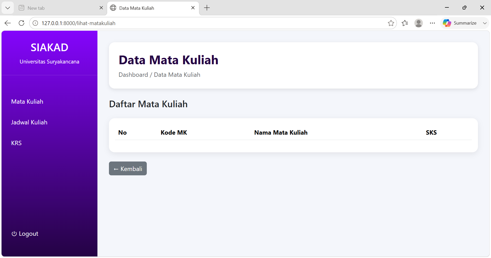

---

## 15. Halaman Lihat Jadwal

Halaman yang digunakan mahasiswa untuk melihat jadwal perkuliahan.

---

## 16. Halaman Lihat KRS

Halaman yang digunakan mahasiswa untuk melihat daftar KRS yang telah diambil.

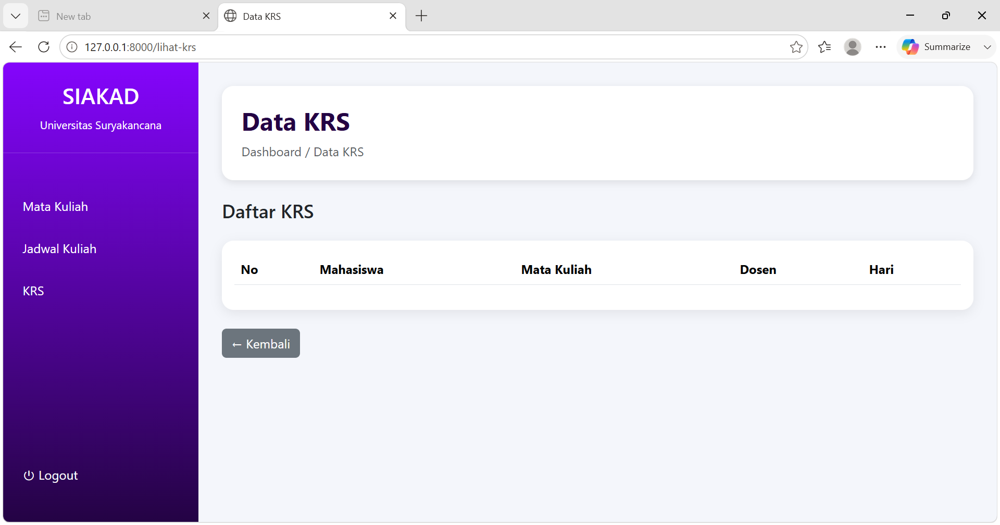

---

## 17. Logout

Fitur logout digunakan untuk keluar dari sistem dan mengakhiri sesi pengguna.

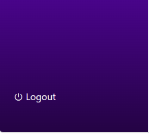

---

# Struktur Database

Database yang digunakan pada aplikasi terdiri dari beberapa tabel utama:

* users
* dosen
* mahasiswa
* mata_kuliahs
* jadwals
* krs

---

# Repository

Project ini dibuat untuk memenuhi Tugas Besar Mata Kuliah Web II dengan tema Sistem Informasi Akademik (SIAKAD) berbasis Laravel.

#  syarifah nadia alysyia 5520124030 IFA2024